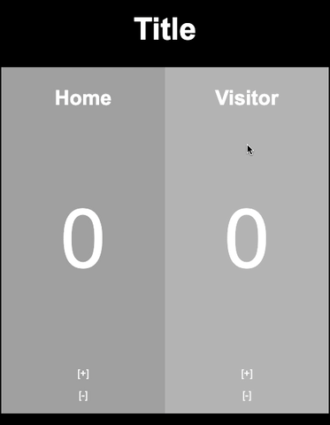

# ScoreBoard

Scoreboard is what you need to make track of game points!

Done to be projected in large screens.

You can change the title and team(players?) names by clicking on them.

The + and - signs increase or decrease points. 

